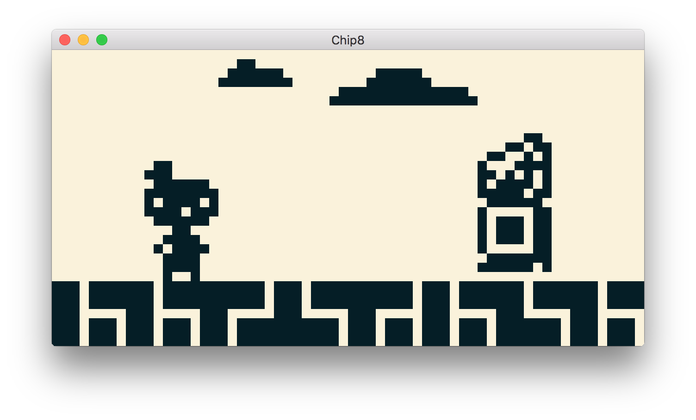

# chipster

Yet another [CHIP-8](https://en.wikipedia.org/wiki/CHIP-8) implementation.

The project is still in early stage, because:

- Not all instructions currently implemented,
- Several of those implemented probably have not been
 tested thoroughly, some other may suffer from quirks (8xy6, 8xyE, Fx55, Fx65),
- Hardcoded controls,  
- Tested only on macOS.

